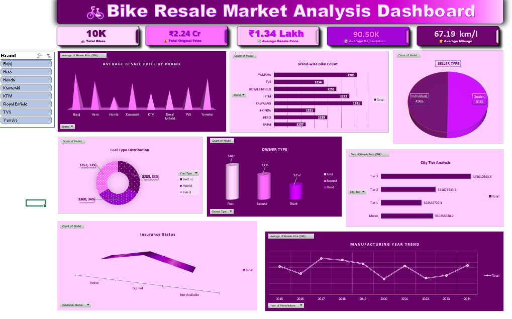

# Bike Resale Market Analysis – Excel

## 📌 Project Overview

This project analyzes used-bike resale data to understand market trends, pricing patterns, brand performance, and other factors related to bike resale values.

This project was completed as part of my Data Analytics training at Brandmonk Academy.

## 🛠️ Tools Used

- Microsoft Excel
- Data Cleaning
- Pivot Tables
- Data Analysis
- Data Visualization
- Excel Dashboard

## 📊 Analysis Performed

- Brand-wise bike analysis
- Average resale price by brand
- Fuel type distribution
- Seller type analysis
- Owner type analysis
- Insurance status analysis
- City tier analysis
- Manufacturing year analysis
- Resale price and depreciation analysis
- Mileage analysis

## 📈 Dashboard

An interactive Excel dashboard was created to summarize the key findings from the dataset.

## 🎯 Project Objective

The main objective of this project is to practice data cleaning, analysis, visualization, and deriving meaningful insights from a real-world-style dataset using Excel.
